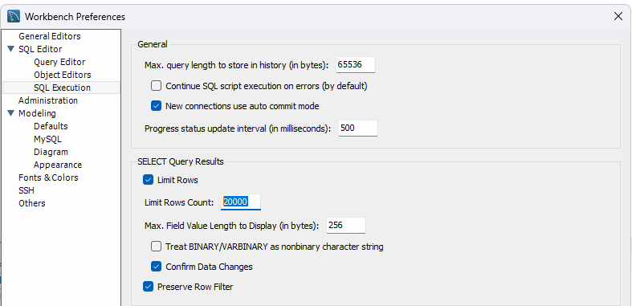
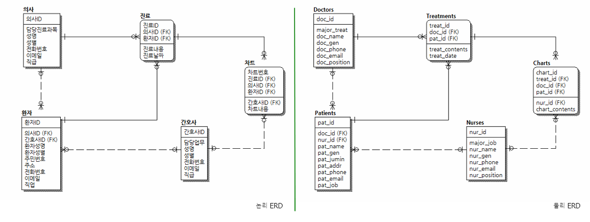
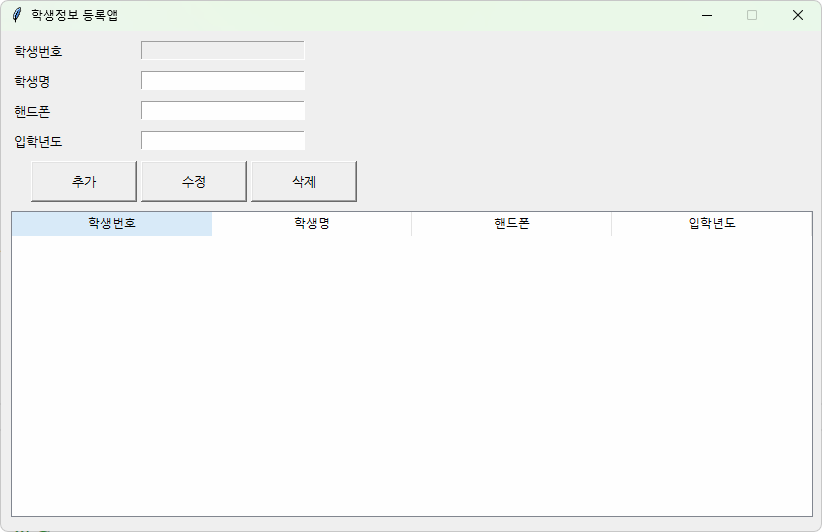
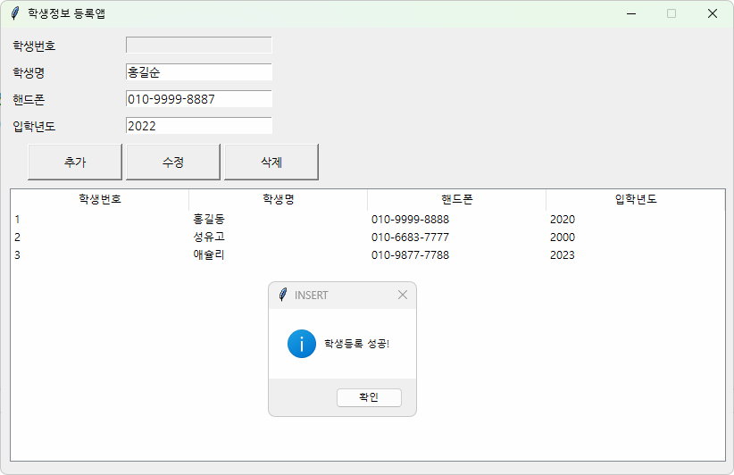

# iot-database-2025
IoT 개발자 데이터베이스 저장소

## 1일차
- 데이터베이스 시스템
    - 통합된 데이터를 저장해서 운영하면서, 동시에 여러사람이 사용할 수 있도록 하는 시스템
    - 실시간 접근, 계속 변경, 동시 공유가 가능, 내용으로 참조(물리적으로 떨어져 있어도 사용가능)

    - DBMS - SQL Server, Oracle, MySQL, MariaDB, MongoDB...

- 데이터베이스 언어
    - SQL - Structured Query Language. 구조화된 질의 언어(프로그래밍언어와 동일)
        - DDL : DB나 테이블 생성, 수정, 삭제 언어
        - DML : 데이터 검색, 삽입, 수정, 삭제
        - DCL : 권한 부여, 해제 제어 언어

- MySQL 설치 (Docker)
    1. 파워쉘을 오픈, 도커 확인
        ```shell
        > docker -v
        Docker version 27.5.1, build 9f9e405
        ```
    2. MySQL Docker 이미지 다운로드
        ```shell
        > docker pull mysql
        Using default tag: latest
        latest: Pulling from library/mysql
        d255dceb9ed5: Download complete
        431b106548a3: Download complete
        893b018337e2: Download complete
        2be0d473cadf: Download complete
        f56a22f949f9: Download complete
        23d22e42ea50: Download complete
        df1ba1ac457a: Download complete
        cc9646b08259: Download complete
        43759093d4f6: Download complete
        277ab5f6ddde: Download complete
        Digest: sha256:146682692a3aa409eae7b7dc6a30f637c6cb49b6ca901c2cd160becc81127d3b
        Status: Downloaded newer image for mysql:latest
        docker.io/library/mysql:latest
        ```
    3. MySQL Image 확인
        ```shell
        > docker images
        REPOSITORY   TAG       IMAGE ID       CREATED       SIZE
        mysql        latest    146682692a3a   4 weeks ago   1.09GB
        ```
    4. Docker 컨테이너에 생성
        - MySQL Port번호는 3306이 기본
        - Oracle Port 1521
        - SQL Server 1433
        ```shell
        > docker run --name mysql-container -e MYSQL_ROOT_PASSWORD=12345 -d -p 3306:3306 mysql:latest
        ```

        - 컴퓨터 재시작후 컨테이너 자동시작 옵션 명령어
        ```shell
        > docker update --restart=always mysql-container
        ```
    5. 컨테이너 확인
        ```shell
        > docker ps -a
        CONTAINER ID   IMAGE          COMMAND                   CREATED              STATUS              PORTS
             NAMES
        60f0890ef88b   mysql:latest   "docker-entrypoint.s…"   About a minute ago   Up About a minute   0.0.0.0:3306->3306/tcp, 33060/tcp   mysql-container
        ```

    6. Docker 컨테이너 시작, 중지, 재시작
        ```shell
        > docker stop mysql-container    # 중지
        > docker start mysql-container   # 시작
        > docker restart mysql-container # 재시작
        ```

    7. MySQL Docker 컨테이너 접속
        ```shell
        > docker exec -it mysql-container bash  # bash 리눅스의 powershell
        bash-5.1# mysql -u root -p
        Enter password:
        Welcome to the MySQL monitor.  Commands end with ; or \g.
        Your MySQL connection id is 9
        Server version: 9.2.0 MySQL Community Server - GPL

        Copyright (c) 2000, 2025, Oracle and/or its affiliates.

        Oracle is a registered trademark of Oracle Corporation and/or its
        affiliates. Other names may be trademarks of their respective
        owners.

        Type 'help;' or '\h' for help. Type '\c' to clear the current input statement.

        mysql> show databases;
        +--------------------+
        | Database           |
        +--------------------+
        | information_schema |
        | mysql              |
        | performance_schema |
        | sys                |
        +--------------------+
        4 rows in set (0.01 sec)
        ```


- workbench 설치
    - https://dev.mysql.com/downloads/workbench/ MySQL Workbench 8.0.41 다운로드 설치
    - MySQL Installer에서 Workbench, Sample 만 설치

    - Workbench 실행 후
        1. MySQL Connections + 클릭

- 관계 데이터 모델
    - 3단계 DB 구조 : 외부 스키마(실세계와 매핑) -> 개념 스키마(DB논리적 설계) -> 내부 스키마(물리적 설계) -> DB
    - 모델에 쓰이는 용어
        - 릴레이션 - 테이블과 매핑
        - 속성 - 테이블 column
        - 튜플 - 테이블 row
        - 관계 - 릴레이션 간의 부모, 자식 연관

    - `무결성 제약조건`
        - 키 - **기본키**, **외래키**, 수퍼키, 후보키, 대리키, 대체키
        - 개체 무결성 제약조건, 참조 무결성 제약조건, 도메인 무결성 제약조건

- SQL 기초
    - SQL 개요

    ```sql
    -- DML SELECT문
    SELECT publisher, price
    FROM Book
    WHERE bookname = '축구의 역사'; -- 주석입니다
    ```


## 2일차
- SQL 기초
    - 개요
        - 데이터베이스에 있는 데이터를 추출 및 처리작업을 위해서 사용되는 프로그래밍언어
        - 일반프로그래밍언어와 차이점
            - DB에서만 문제해결 가능
            - 입출력을 모두 DB에서 테이블로 처리
            - 컴파일 및 실행은 DBMS가 수행
        - DML(데이터 조작어) - 검색, 삽입, 수정, 삭제
            - SELECT, INSERT, UPDATE, DELETE
        - DDL(데이터 정의어)
            - CREATE, ALTER, DROP
        - DML(데이터 제어어)
            - GRANT, REVOKE

    - DML 중 SELECT

        ```sql
        -- SELECT문 기본문법
        SELECT [ALL|DISTINCT] 컬럼명(들)
          FROM 테이블명(들)
        [WHERE 검색조건(들)]
        [GROUP BY 속성이름(들)]
        [HAVING 집계함수검색조건(들)]
         [ORDER BY 정렬할속성(들) [ASC|DESC]]
          [WITH ROLLUP]
        ```

        - 쿼리 연습(정렬까지) : [SQL](./day02/db02_select쿼리연습.sql)
        - 쿼리 연습(집계함수부터) : [SQL](/day02/db03_select_집계함수부터.sql)


## 3일차
- Visual Studio Code에서 MySQL 연동
    - 확장 > MySQL 검색
        - Weijan Chen 개인개발자가 만든 MySQL 확장도 준수
        - Weijan Chen 개발한 Database Client를 설치 (추천)
            - 데이터베이스 아이콘 생성
        - Database Client 는 많은 DB 연결이 가능!
        - Oracle에서 개발한 MySQL Shell for VS Code를 사용 하지말것 (너무 불편함)
    - Database Client
        1. 툴바의 Database 아이콘
        2. Create Connection 클릭
        3. 정보 입력 > 연결 테스트

            

        4. Workbench 처럼 사용

            


- SQL 기초
    - 기본 데이터형
        - 데이터베이스에는 엄청 많은 데이터형이 존재(데이터의 사이즈 저장용량을 절약하기 위해서)
        - 주요 데이터형
            - SmallInt(2byte) - 65535가지 수(음수포함)를 저장(-32768~32767)
            - **Int(4)** - 모든 데이터타입의 기준! 42억 정수(음수)를 저장
            - BigInt(8) - Int보다 더 큰수 저장
            - Float(4) - 소수점아래 7자리까지 저장
            - Decimal(5 ~ 17) - Float보다 더 큰 수 저장시
            - Char(n) - n은 가변(1 ~ 255). 고정길이 문자열
                - 주의점! Char(10)에 Hello 글자를 입력하면 **'Hello     '** 과 같이 저장!
            - Varchar(n) - n(1 ~ 65535). 가변길이 문자열
                - 주의점! Varchar(10)에 Hello를 입력하면 **'Hello'** 저장됨
            - Longtext(최대4GB) - 뉴스나 영화스크립트 저장할 때 사용
            - LongBlob(최대4GB) - mp3, mp4 음악, 영화데이터 자체 저장할 때 사용
            - Date(3) - 2025-02-27 까지 저장하는 타입
            - DateTime(8) - 2025-02-27 10:46:34 까지 저장하는 타입
            - JSON(8) - json 타입 데이터를 저장


        - DDL 중 CREATE : [SQL](/day03/db01_ddl_쿼리.sql)

            ```sql
            CREATE DATABASE 데이터베이스명
            [몇가지 사항];
            
            CREATE 테이블명
            (
                컬럼(속성)명 제약사항들,...
                PRIMARY KEY (컬럼(들))
                FOREIGN KEY (컬럼(들)) REFERENCES 테이블명(컬럼(들)) ON 제약사항
            );
            ```
            - DDL문은 Workbench에서 마우스 클릭으로 많이 사용(사용빈도 낮음)
            - 테이블 생성 후 확인
                1. 메뉴 Database > Reverse Engineer(데이터베이스를 ERD 변경) 클릭
                2. 연결은 패스
                3. Select Schemas to RE 에서 특정 DB를 선택
                4. Execute 버튼을 클릭
                5. ERD을 확인

                

    - DDL 중 ALTER
        ```sql
            CREATE DATABASE 데이터베이스명
            [몇가지 사항];

            CREATE 테이블명
                [ADD 속성명 데이터타입]
                [DROP COLUMN 속성명]
                [ALTER COLUMN 속성명 데이터타입]
                -- ...
        ```

        -테이블 수정

    - DDL 중 DROP
        ```sql
        DROP [DATABASE|TABLE|INDEX...] 개체명
        ```
        - 테이블 삭제. 복구 안됨! 백업필수

    - DML 중 INSERT, UPDATE, DELETE : [SQL](/day03/db02_dml_쿼리.sql)

        ```sql
        -- 삽입
        INSERT INTO 테이블명 [(컬럼리스트)]
        VALUES (값리스트); -- VALUE는 SQL표준이 아님 (MySQL, PostgreSQL 등 에서만 사용가능)

        -- 다른테이블의 데이터 가져오기
        INSERT INTO 테이블명 [(컬럼리스트)]
        SELECT 컬럼리스트 FROM 테이블명
        [WHERE 조건];

        -- 수정
        UPDATE 테이블명 SET
               속성=값
            [, 속성=값]
         WHERE 조건;

        -- 삭제
        DELETE FROM 테이블명
         WHERE 조건;
        ```

        - INSERT 데이터 삽입, 새로운 데이터 생성
        - UPDATE 데이터 수정, 기존 데이터를 변경
        - DELETE 데이터 삭제
        - `UPDATE와 DELETE는 WHERE절 없이 사용하면 문제발생 소지`
            - 트랜잭션을 사용하지 않으면 복구가 어려움. **조심할 것**

- SQL 고급
    - 내장함수, NULL : [SQL](./day03/db03_sql_고급.sql)
        - 수학함수, 문자열함수, 날짜함수 등

## 4일차
- SQL 고급 : [SQL](./day04/db01_sql고급.sql)
    - 행번호출력
        - LIMIT, OFFSET 잘써도 필요없음
        - 행번호가 필요한 경우도 있음

- SubQuery 고급 : [SQL](./day04/DB02_sql고급_서브쿼리.sql)
    - Where절 - 단일값(비교연산), 다중행(ALL|ANY|EXISTS|IN|NOT IN...)
    - Select절 - 무조건 스칼라값
    - From절 - 인라인뷰. 하나의 테이블처럼 사용 - 가상테이블

- SQL 고급
    - 뷰 : [SQL](./day04/db03_sql고급_뷰.sql)
        - 자주 사용할 쿼리로 만들어진 가상 테이블을 계속 사용하기 위해서 만든 개체
        - 입력, 수정도 가능. 조인된 뷰는 불가능
        - 보안적, 재사용성, 독립성을 위해서 사용
    - 인덱스 : [SQL](./day04/db04_sql고급_인덱스.sql)
        - 빠른 검색을 위해서 사용하는 개체
        - 클러스터 인덱스 : 기본키에 자동으로 생성되는 인덱스(테이블당 1개)
        - 논클러스터(보조) 인덱스 : 수동으로 컬럼들에 생성할 수 있는 인덱스(여러개 가능)
        - 주의점
            - WHERE절에 자주 사용하는 컬럼에 인덱스 생성
            - 조인문에 사용하는 컬럼(PK포함) 인덱스 생성
            - 테이블당 인덱스 개수는 5개 미만 생성할 것(너무 많으면 성능저하)
            - 자주 변경되는 컬럼에는 인덱스 생성하지 말것(성능저하)
            - NULL값이 많은 컬럼에 인덱스 생성말 것(성능저하)

- 데이터베이스 프로그래밍
    - 저장 프로시저 : [SQL](./day04/db05_저장프로시저1.sql)
        - 너무 많은 쿼리로 일을 처리해야 할때, 파이썬등 프로그램에서 구현하면 매우 복잡함
        - 저장 프로시저 하나로 프로그램 구현시 코드가 매우 짧아짐
        - 개발 솔루션화, 구조화 해서 손쉽게 DB처리를 가능하게 하기 위해서
        - 예제 : [SQL](./day04/db06_저장프로시저2.sql)


## 5일차
- 데이터베이스 프로그래밍
    - 리턴문을 쓸 수 있으면 함수, 아니면 프로시저.
    - 프로시저에서도 값을 반환하려면 OUT 파라미터를 선언.
    - 저장 프로시저 계속
        - 결과를 반환하는 프로시저 : [SQL](./day05/db01_저장프로시저3.sql)
        - 커서사용 프로시저 : [SQL](./day05/db02_저장프로시저4.sql)
    - 트리거 : [SQL](./day05/db04_트리거.sql)
    - 사용자 정의함수 : [SQL](./day05/db03_사용자정의함수.sql)
        - 리턴 키워드 사용

- 데이터베이스 연동 프로그래밍
    - PyMySQL 모듈사용
    - 파이썬 DB연동 콘솔 : [노트북](./day05/db05_파이썬_DB연동.ipynb)
    - 파이썬 DB연동 웹(Flask) : [Python](./day05/index.py)
        - templates 폴더내 html 저장

- 데이터모델링
    - 현실세계에 데이터처리내용을 디지털 환경에 일치시켜서 모델링
    - DB 생명주기
        1. 요구사항 수집 및 분석
        2. 설계
        3. 구현
        4. 운영
        5. 감시 및 개선
    - 모델링 순서
        1. 개념적 모델링 - 요구사항 수집분석 내용 토대로 러프하게 전체 뼈대를 세우는 과정
        2. 논리적 모델링 - ER다이어그램 체계화. DBMS에 맞게 매핑. 키 선정(추가), 정규화, 데이터 표준화
        3. 물리적 모델링 - DBMS 종류에 맞게 데이터타입 지정, 물리적 구조 정의. 응답시간 최소화/트랜잭션 검토/저장공간 배치
    - 현재 ER다이어그램은 IE(Information Engeenering) 방식으로 설계
    - ERWin 설계 실습 : [ERWin](./day05/madangstore.erwin)

## 6일차
- 데이터모델링 계속 : [SQL](./day06/마당대학_스키마.sql)
    - 마당대학 데이터베이스 with Workbench : db01_마당대학.nwb(MySQL Workbench Model)
    - Forward Engineering 으로 DB 생성 확인
- 정규화 : [SQL](./day06/db03_정규화_이상현상.sql)
    - 이상현상 : 삽입이상, 삭제이상, 수정이상
        - 정규화를 제대로 못한 DB면 발생 가능
    - 함수 종속성 - 하나의 속성(A)이 다른 속성(B)을 결정지으면 A는 B의 결정자. A → B
        - 완전함수종속 - 종속성에 일치하지 않는 속성들이 하나도 없는 경우
        - 이행적종속 - A → B, B → C 일때 A → C 가 되는 종속성
        - BCNF해당하지 않는 경우 - A → C, B → C일 경우 C → B 경우가 발생
    - 정규화 - 이상현상이 발생하지 않도록 릴레이션(개체, 테이블)을 분해하는 과정
        - 제1정규화 - 속성이 원자값을 가지도록 만드는 정규화(한 컬럼에 여러값이 들어갈 수 없음)
        - 제2정규화 - 모든 릴레이션의 속성이 완전함수종속을 하는 정규화
        - 제3정규화 - 이행적 종속이 발생하지 않도록 정규화
        - BCNF정규화 - 함수종속성 A → B가 성립시 모든 결정자 A가 후보키가 되는 정규화(무손실 분해)
        - 제4정규화 - 실무에서 사용안함. 다치종속성 릴레이션 가진 정규화
        - 제5정규화 - 실무에서 사용안함. 프로젝트-조인 정규형. 조인 종속성을 가진 릴레이션
    - 트랜잭션 : [SQL](./day06/db05_트랜잭션2.sql)
        - 데이터를 다루는 논리적인 작업단위
        - START TRANSACTION, SAVEPOINT, ROLLBACK [TO SAVEPOINT], COMMIT 트랜잭션 처리
        - 특징
            - A(원자성) - Atomicity, 원자처럼 쪼개지지 않고 한 덩어리로 취급, All or nothing.
            - C(일관성) - Consistency, 트랜잭션 전후의 데이터가 일관되게 저장되어 있어야 함.
            - I(고립성) - Isolation, 트랙잭션이 발생할 동안 다른 트랙잭션이 값을 수정하지 못하게 막음.
            - D(지속성) - Durability, 트랙잭션 후에 저장된 데이터는 무한히 값이 유지되어야 함.
        - 동시성 제어 : [SQL](./day06/db09_동시성제어1.sql) / [SQL](./day06/db10_동시성제어2.sql)
            - 락

## 7일차
- Workbench Tip
    - SQL툴 공통으로 SELECT 실행시 모든 행을 다 표시하지 않음.(성능저하 대비)
    - Workbench는 1000개로 제한
    - 성능테스트 시 1000개 제한을 풀어줘야 함
    - 메뉴 `Edit > Preferences > SQL Editor > SQL Exection 에서 Limit Rows Count`를 조절

    
    
- 인덱스 실습 : [SQL](./day07/db01_인덱스연습.sql)
    - 500만건 조회시 price로 검색
        - 인덱스가 없으면 0.67초 소요
        - 인덱스를 걸면 0.06초 소요

- 데이터베이스 관리와 보안 : [SQL](/day07/db02_DB관리.sql)
- 실무실습 : [SQL](./day07/db03_쿼리연습.sql)
    - 서브쿼리 까지

## 8일차
- 실무실습 : [SQL](./day08/db01_쿼리실습.sql)
    - 서브쿼리부터
- 데이터모델링 실습
    - 병원업무관리 ERD
        - 요구사항으로 개체와 관계를 정립. 계체에 속하는 속성들, 식별자 결정
        - ERwin | Workbench 모델링에서 ERD 작성
        - 생성스크립트 : [SQL](./day08/db03_병원업무관리_스키마.sql)
        - Workbench에서 DB생성 후 위 스크립트 실행. DB구현

    
    
    - SQL 연습

## 9일차
- tkinter DB연동 GUI앱 개발 : [Python](./day09/students_regapp.py)
    1. MySQL madang 데이터베이스 사용하는 madang 사용자 생성, 권한
    2. madang DB에 students 테이블 생성 및 더미데이터 추가
        ```sql
        drop table if exists students; -- 현재 테이블 삭제
        create table students (
            std_id integer primary key auto_increment, -- auto_increment는 MySQL 옵션.
            std_name varchar(100) not null,
            std_mobile varchar(1),
            std_regyear int not null
        );
            -- 더미데이터 추가
            insert into students (std_name, std_mobile, std_regyear)
            values('홍길동', '010-9999-8888', 2020);
     
        ```

    3. tkinter 템플릿코드 작성 - 기본적인 GUI앱 틀

        

    4. 데이터베이스 CRUD 함수 구현

        
        
- 데이터베이스 연습
    - SQL, 모델링 연습
- 코딩테스트